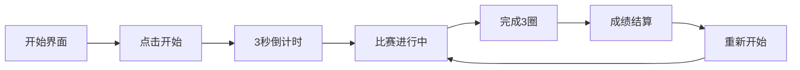

## 1. 产品概述

极速霓虹 - 一款纯前端H5机车竞速小游戏，玩家驾驶摩托车在霓虹赛道上疾驰，与AI对手竞速比拼。游戏采用赛博朋克霓虹风格，支持键盘和触屏双操控，打开HTML即可游玩，无任何外部依赖。

## 2. 核心功能

### 2.1 功能模块
1. **赛道系统**：环形赛道渲染、弯道设计、赛道边缘检测
2. **机车操控**：加速、刹车、转向、漂移物理效果
3. **碰撞系统**：赛道边界碰撞、机车间碰撞、碰撞减速惩罚
4. **AI对手**：3个AI机车对手，具备不同难度的驾驶策略
5. **计分系统**：圈数计时、排名显示、最佳成绩记录
6. **操控系统**：键盘操控（方向键/WASD）、触屏虚拟按键

### 2.2 页面详情

| 页面名称 | 模块名称 | 功能描述 |
|-----------|-------------|---------------------|
| 游戏主界面 | 开始界面 | 游戏标题、开始按钮、操作说明 |
| 游戏主界面 | 游戏画布 | Canvas渲染赛道、机车、UI信息 |
| 游戏主界面 | HUD显示 | 速度表、圈数、时间、排名 |
| 游戏主界面 | 结束界面 | 最终排名、成绩展示、重新开始 |

## 3. 核心流程

玩家进入游戏 → 点击开始 → 3秒倒计时 → 比赛开始 → 操控机车竞速（3圈）→ 冲线结束 → 显示成绩 → 可重新开始

## 4. 用户界面设计

### 4.1 设计风格
- **主色调**：深黑色背景 (#0a0a1a) + 霓虹青色 (#00f5ff) + 霓虹粉色 (#ff00ff) + 霓虹黄色 (#ffff00)
- **视觉风格**：赛博朋克霓虹风，发光效果，动态光轨
- **字体**：使用等宽字体增强科技感
- **按钮风格**：霓虹边框发光按钮，悬停时有脉冲动画

### 4.2 页面设计概览

| 页面名称 | 模块名称 | UI元素 |
|-----------|-------------|-------------|
| 游戏主界面 | 开始界面 | 霓虹标题、开始按钮、操作说明卡片 |
| 游戏主界面 | 游戏画布 | 俯视视角赛道、发光机车、速度线特效 |
| 游戏主界面 | HUD界面 | 速度仪表盘、圈数计数器、计时器、排名榜 |
| 游戏主界面 | 结束弹窗 | 成绩卡片、排名列表、重试按钮 |

### 4.3 响应式
- 桌面端：全屏Canvas，键盘操控
- 移动端：自适应屏幕尺寸，虚拟方向键和加速/刹车按钮
- 触屏优化：大尺寸触控按钮，防止误触

### 4.4 游戏画面设计
- **视角**：俯视2D视角
- **赛道**：深色沥青路面，霓虹发光边缘线，弯道漂移痕迹
- **机车**：简化几何造型，霓虹色车身，尾焰特效
- **特效**：速度线、漂移烟雾、碰撞火花、地面光影
