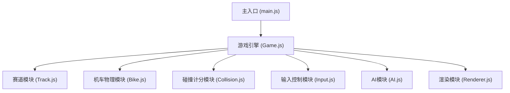

## 1. 架构设计

游戏采用模块化架构，三大核心模块独立解耦，通过事件总线和共享状态进行通信。



## 2. 技术描述

- **前端技术栈**：HTML5 Canvas + 原生 JavaScript (ES6+) + CSS3
- **无构建工具**：纯静态文件，直接打开 HTML 即可运行
- **无外部依赖**：不引入任何第三方库，全部原生实现
- **动画循环**：requestAnimationFrame 实现60fps游戏循环
- **状态管理**：简单状态机管理游戏状态（菜单、倒计时、比赛中、结束）

## 3. 模块架构

### 3.1 目录结构

```
/
├── index.html          # 主入口文件
├── css/
│   └── style.css       # 样式文件
└── js/
    ├── main.js         # 入口文件
    ├── Game.js         # 游戏主控制器
    ├── Track.js        # 赛道生成与渲染
    ├── Bike.js         # 机车物理引擎
    ├── Collision.js    # 碰撞检测与计分
    ├── AI.js           # AI对手逻辑
    ├── Input.js        # 输入控制（键盘+触屏）
    ├── Renderer.js     # Canvas渲染器
    └── utils.js        # 工具函数
```

### 3.2 模块职责

| 模块 | 职责 | 核心API |
|------|------|---------|
| Track.js | 赛道数据生成、路径计算、碰撞边界 | `getPointAtDistance()`, `isInsideTrack()`, `getTrackWidth()` |
| Bike.js | 机车物理模拟、状态更新 | `update()`, `accelerate()`, `brake()`, `steer()` |
| Collision.js | 碰撞检测、圈数计算、得分 | `checkTrackCollision()`, `checkBikeCollision()`, `updateLap()` |
| AI.js | AI驾驶决策、路径追踪 | `update()`, `getSteerInput()`, `getThrottleInput()` |
| Input.js | 键盘+触屏输入采集 | `isKeyDown()`, `getTouchState()` |
| Renderer.js | Canvas绘制、UI渲染 | `render()`, `drawTrack()`, `drawBike()`, `drawHUD()` |

## 4. 核心数据结构

### 4.1 机车状态

```javascript
{
  x: number,           // 位置X
  y: number,           // 位置Y
  angle: number,       // 朝向角度（弧度）
  speed: number,       // 当前速度
  maxSpeed: number,    // 最大速度
  acceleration: number,// 加速度
  steerSpeed: number,  // 转向速度
  driftAngle: number,  // 漂移角度
  color: string,       // 车身颜色
  lap: number,         // 当前圈数
  checkpoint: number,  // 检查点索引
  raceTime: number,    // 比赛用时
  isPlayer: boolean    // 是否玩家
}
```

### 4.2 赛道数据

```javascript
{
  points: Array<{x, y}>,  // 赛道中心线关键点
  width: number,          // 赛道宽度
  totalLength: number,    // 赛道总长度
  checkpoints: Array      // 检查点位置
}
```

## 5. 物理模型

### 5.1 运动物理
- 加速度与速度呈线性关系
- 摩擦阻力随速度增加
- 转向角度与速度成反比（速度越快转向越慢）

### 5.2 漂移机制
- 高速转向时触发漂移
- 漂移时外侧轮胎打滑
- 漂移产生额外减速但可保持更高过弯速度
- 漂移角度越大，赛道摩擦越小（漂移出赛道风险）

### 5.3 碰撞响应
- 边界碰撞：速度衰减50%，反弹回赛道内
- 机车碰撞：相互推开，速度衰减30%

## 6. 游戏状态

```
MENU → COUNTDOWN → RACING → FINISHED
  ↑                          ↓
  └──────────────────────────┘
```

- **MENU**：开始菜单
- **COUNTDOWN**：3秒倒计时
- **RACING**：比赛进行中
- **FINISHED**：比赛结束，显示成绩
